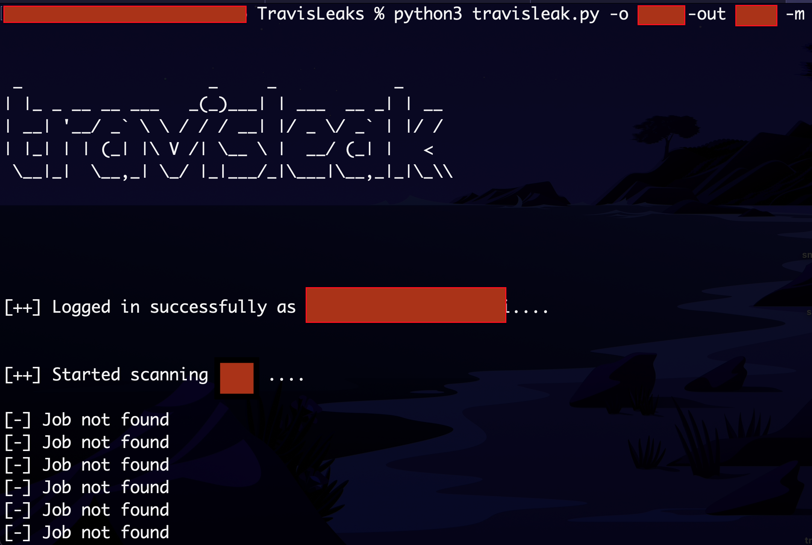

# TravisLeaks :rocket:
A tool to find sensitive keys and passwords in Travis logs


</br>

## Description
Read the Blog post [here](https://blog.shashank.co/2019/05/finding-leaks-in-travis-logs-automated.html)


Just enter the Travis user name of the organization. The script will automatically find out all jobs and then do two things:
1. Look for ED's keywords for potential leaks
2. Use the concept of entropy to find potential API keys in the logs 


## Requirements (using travisleak.py script)

> Python 3.X  
> ``` pip install -r requirements.txt ```
> 
> Optional: Github Token for scanning GitHub's Org members 
> 
> ```export GITHUB API KEY="" ```

## Usage
> python travisleak.py -o travis_user_name -m -out Directory_to_write_output_to
>
> -m Optional to scan Organization's members  


<br>

<div style='float: center'>
  </img>
</div>


</br>


</br></br>

Credits:-


The keywords for the potential leak was taken from ED's blog post [here](https://edoverflow.com/2019/ci-knew-there-would-be-bugs-here/)


The concept of entropy was adapted from [here](https://github.com/dxa4481/truffleHog)


## Note
This tool still needs a lot of development. I would be glad if someone would like to contribute to this project.

## Goals
- [x] Better output format 
- [ ] Support CircleCI scans
